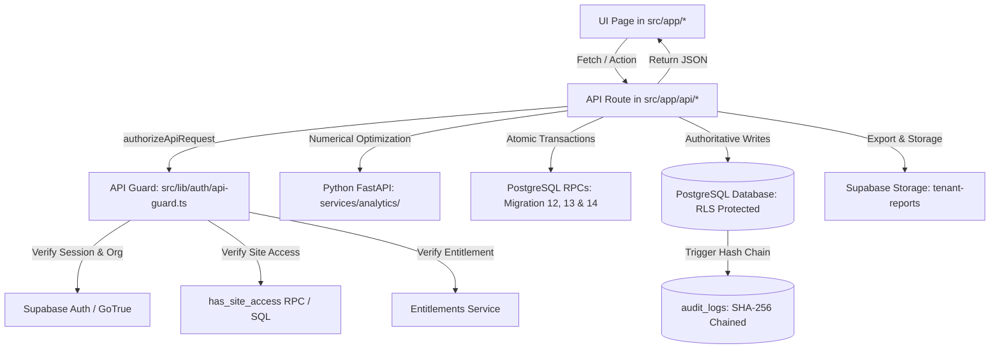

# CODEBASE_MAP.md — Architectural & Subsystem Navigation

This document maps the architectural flow and directory structure of the Aetheon platform.

## 1. Master Request & Data Lifecycle Flow



## 2. Directory Structure & Primary Responsibilities

```
d:/Consultancy Project/Aetheon-SAAS/
├── src/
│   ├── app/                      # Next.js App Router (39 routes)
│   │   ├── (modules)/            # bess, dsm, grid-intelligence, compliance, renewables
│   │   ├── admin/                # Internal Aetheon platform operations
│   │   ├── alerts/, reports/     # Notification hub and reporting center
│   │   ├── api/                  # 15 backend API route handlers
│   │   ├── auth/                 # Login, register, invite, onboarding flows
│   │   └── settings/             # Organization profile, sites, CSV ingestion gateway
│   ├── components/               # React components
│   │   ├── layout/               # AppShell, SiteContext, Sidebar, Header
│   │   ├── shared/               # Block96Chart, QualityBadge, DemoBadge
│   │   └── ui/                   # Button, Card, Dialog, Badge, Tabs, Select
│   ├── features/                 # Domain logic
│   │   ├── billing/              # Razorpay adapter, checkout mapping
│   │   ├── compliance/           # RegulatoryResolver (approval gate & voltage matching)
│   │   ├── entitlements/         # Entitlement evaluator, product catalog
│   │   ├── ingestion/            # CSV validator (96-block contiguity)
│   │   └── quality/              # QualityGate (freshness, completeness, publication gate)
│   ├── lib/                      # Core infrastructure utilities
│   │   ├── analytics/            # FastAPI HTTP client with fail-closed token auth
│   │   ├── auth/                 # API guard, role boundaries, session management
│   │   ├── supabase/             # Browser, server, and service-role clients
│   │   └── units/                # Currency (paise/INR) formatting utilities
│   └── types/                    # Canonical TypeScript interfaces & publication gate types
├── services/
│   └── analytics/                # Python 3.11 / FastAPI microservice
│       ├── main.py               # API endpoints (/forecast, /dsm, /bess, /renewables)
│       ├── solvers.py            # NumPy / Pandas numerical algorithms
│       ├── schemas.py            # Pydantic input/output validation models
│       └── tests/                # Pytest unit tests (test_analytics.py)
├── supabase/
│   ├── migrations/               # 14 versioned SQL DDL/RLS migrations
│   └── seed.sql                  # Canonical seed data (discom tariffs, demo org, non-demo org, CEA factors)
├── tests/
│   ├── unit/                     # Fast isolated unit tests (csv, currency, quality, etc.)
│   ├── integration/              # Live DB tests (supabase_rls, audit_chaining, adversarial_api, surgical_fixes)
│   └── e2e/                      # Playwright suites (demo_smoke, registration, persistence, real_auth)
├── scripts/                      # Operational scripts (seed_auth_users.mjs, package_review.ps1)
└── docs/                         # Specification, handoff, and context layer
```

## 3. Subsystem Cross-Reference

| Subsystem | Primary UI Entry | Primary API Handler | Core Database Tables | Key Service / Helper |
|---|---|---|---|---|
| **Tenancy / Sites** | `src/components/layout/SiteContext.tsx` | `src/app/api/sites/route.ts` | `organisations`, `sites`, `site_access` | `has_site_access()` RPC |
| **Auth / RBAC** | `src/app/auth/login/page.tsx` | `src/lib/auth/api-guard.ts` | `user_profiles`, `memberships` | `authorizeApiRequest()` |
| **Ingestion** | `src/app/settings/page.tsx` | `src/app/api/ingestion/commit/route.ts` | `ingestion_runs`, `interval_data_96` | `commit_ingestion_transaction()` |
| **Grid Forecast** | `src/app/grid-intelligence/page.tsx` | `src/app/api/forecast/route.ts` | `grid_forecast_runs`, `grid_forecast_blocks` | `services/analytics/solvers.py` |
| **DSM Monitor** | `src/app/dsm/page.tsx` | `src/app/api/dsm/route.ts` | `dsm_evaluation_runs`, `dsm_incidents` | `acknowledge_dsm_incident_atomic()` |
| **BESS Advisory**| `src/app/bess/page.tsx` | `src/app/api/bess/route.ts` | `bess_assets`, `bess_signal_runs` | `fetchBESSOptimisation()` |
| **Compliance** | `src/app/compliance/page.tsx` | `src/app/api/compliance/route.ts` | `regulatory_sources`, `compliance_obligations` | `RegulatoryResolver.ts` |
| **Renewables** | `src/app/renewables/page.tsx` | `src/app/api/renewables/route.ts` | `renewable_assets`, `emission_factors` | CEA v19 Factor Lookup |
| **Reports** | `src/app/reports/page.tsx` | `src/app/api/reports/generate/route.ts` | `report_records` | `/api/reports/[id]/download` |
| **Alerts** | `src/app/alerts/page.tsx` | `src/app/api/alerts/[id]/acknowledge/route.ts` | `alerts`, `notification_logs` | `acknowledge_alert_atomic()` |
| **Billing** | `src/app/settings/page.tsx` | `src/app/api/billing/checkout/route.ts` | `subscriptions`, `invoices`, `billing_checkout_sessions` | `process_razorpay_webhook_atomic()` |
| **Admin** | `src/app/admin/page.tsx` | `src/app/api/admin/audit/route.ts` | `audit_logs`, `regulatory_sources` | SHA-256 Advisory Lock Trigger |
