# SECURITY_MAP.md — Security & Authorization Architecture

This map outlines the multi-layered security model protecting tenant isolation, roles, operational outputs, and audit logs.

## 1. Master Security Chain

```mermaid
graph LR
    USER[User Session / JWT] --> AUTH[GoTrue Auth]
    AUTH --> PROF[user_profiles: is_platform_admin]
    PROF --> MEM[memberships: Role & Org]
    MEM --> SITE[has_site_access RPC: Site Boundary]
    SITE --> ENT[entitlements: Product Access]
    ENT --> API_GUARD[authorizeApiRequest: Next.js API Guard]
    API_GUARD --> RLS[PostgreSQL RLS: 70 Policies]
    RLS --> RPC[Security Definer RPC: service_role Only]
    RPC --> DB[(Encrypted Database Tables)]
```

## 2. Roles & Privilege Boundaries

### Customer Roles (Scoped to `organisation_id`)
- `ORGANISATION_ADMIN`: Full administrative control over tenant organisation, user invites, site access assignments, and billing checkout. Blocked from internal platform admin endpoints.
- `ENERGY_MANAGER`: Facility operational management, CSV ingestion, BESS configuration, and report generation.
- `OPERATOR`: Day-to-day monitoring, incident acknowledgement. Blocked from modifying site electrical configuration or cancelling subscriptions.
- `FINANCE_SUSTAINABILITY_VIEWER`: Read-only access to commercial invoices, checkout sessions, notification logs, and emission ledgers.

### Internal Platform Roles (Aetheon Operations)
- `AETHEON_ANALYST`: Temporary elevated support role. Must have `expires_at` set to $\le 24$ hours at write-time (`trg_enforce_analyst_session_limit`). Expired sessions are rejected at runtime across all endpoints.
- `AETHEON_REGULATORY_REVIEWER`: Internal legal/regulatory role authorized to transition regulatory sources to `APPROVED` / `PUBLISHED`.
- **Anti-Escalation Rule**: Trigger `trg_enforce_membership_role_boundary` prevents customer `ORGANISATION_ADMIN`s from assigning internal roles. Trigger `trg_protect_user_profile_escalation` prevents setting `is_platform_admin = true`.

## 3. Row-Level Security (RLS) Policies
- All 19 public tables have `rowsecurity = true` with 71 active public policies verified in PostgreSQL 17.6.
- **Tenant Isolation**: Queries enforce `is_org_member(organisation_id)` or `has_site_access(site_id)`.
- **Server-Only Operational Writes**: Tables `forecast_runs`, `grid_forecast_blocks`, `bess_signal_runs`, `dsm_incidents`, `dsm_evaluation_runs`, `interval_data_96`, `ingestion_runs`, `site_activation_history`, and `report_records` reject all direct INSERT/UPDATE/DELETE from client sessions (`auth.role() = 'service_role'` required).
- **Notification Privacy**: `notification_logs` allows SELECT only for `ORGANISATION_ADMIN`, `FINANCE_SUSTAINABILITY_VIEWER`, or `recipient_email = auth.users.email`.
- **Site Access Grants**: `site_access` allows SELECT only to the specific user or Org Admins; writes restricted to Org Admins.
- **Durable Webhook Quarantine**: Unmapped webhook events insert into `processed_webhook_events` with status `'QUARANTINED'` without granting customer entitlements, preventing silent transaction rollbacks.

## 4. Cryptographic Audit Immutability
- **SHA-256 Hash Chain**: Each audit record calculates `current_hash = SHA256(previous_hash + actor_id + action + entity_type + created_at)`.
- **Advisory Lock**: `PERFORM pg_advisory_xact_lock(hashtext('audit_logs_hash_chain'))` serializes hash generation to prevent chain forks under concurrent inserts.
- **Immutable Trigger**: Rejects all UPDATE and DELETE commands on `audit_logs`.

## 5. Storage Security
- Private Supabase buckets: `tenant-uploads`, `tenant-reports`, `regulatory-docs`.
- Direct public URLs are disabled. Access is mediated via signed short-lived download URLs issued by `/api/reports/[id]/download` after verifying site access and module entitlement.

## 6. RPC Function Privilege Lockdowns
- All 18 database routines/triggers (`commit_ingestion_transaction`, `acknowledge_alert_atomic`, `acknowledge_dsm_incident_atomic`, `process_razorpay_webhook_atomic`, etc.) are owned by `postgres` and granted `EXECUTE` strictly to `service_role`. Client roles `anon` and `authenticated` have zero direct execution privileges on core mutating RPCs.

## 7. Controls Requiring Production Configuration / Audit
- **MFA / AAL2**: Requires production Supabase Auth authenticator configuration (`PRODUCTION_CONFIG_REQUIRED`).
- **External Penetration Testing**: Third-party verification of JWT token reuse, forged signatures, and side-channel leakage.
- **Live Razorpay Webhook Secrets**: Live signature verification key rotation in vault.

